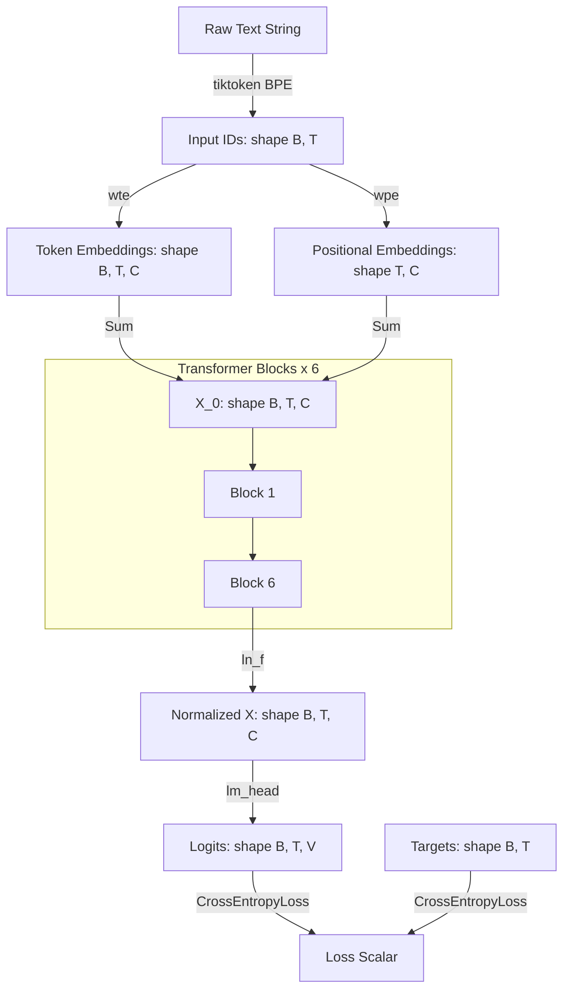

# 01. Architecture: Token-to-Loss Lifecycle

This document explains the end-to-end mathematical lifecycle of data passing through the custom GPT-2 architecture, parameter counting, and compute/memory math.

---

## 1. The Token-to-Loss Lifecycle

### Explanation of Stage Flow:
1. **Raw Text String**: An input sequence of text (e.g. Shakespeare).
2. **Tokenization**: Handled in [data.py](file:///Users/ahadk9/Projects/Andrej/data.py) using the tiktoken GPT-2 encoder, converting characters to integer token IDs of shape $(B, T)$ where $B$ is batch size and $T$ is sequence context length.
3. **Embeddings**: In [model.py](file:///Users/ahadk9/Projects/Andrej/model.py#L185-L186), we use two embedding matrices:
   - Token Embedding `wte`: Maps $(B, T)$ to $(B, T, C)$ via lookup in a matrix of size $V \times C$ (where $C = \text{n\_embd}$).
   - Position Embedding `wpe`: Maps absolute token index $0 \dots T-1$ to a spatial embedding vector of shape $(T, C)$.
4. **Summation**: Token and positional embeddings are summed element-wise to form the initial hidden state $X_0$ of shape $(B, T, C)$.
5. **Transformer Blocks**: The hidden state flows sequentially through 6 transformer blocks [model.py:L187](file:///Users/ahadk9/Projects/Andrej/model.py#L187). Each block applies Layer Normalization, Causal Self-Attention, and Multi-Layer Perceptron sub-layers with residual connections, keeping the shape $(B, T, C)$ constant.
6. **Final Norm**: The output of the final block is passed through a LayerNorm layer `ln_f` to normalize values along the embedding dimension.
7. **LM Head**: Normalized states are projected back to vocabulary space via `lm_head` (shape $C \times V$), yielding the logits of shape $(B, T, V)$ representing raw scores for each vocabulary token.
8. **Loss**: Cross Entropy loss computes the negative log probability of the true target tokens.

---

## 2. Tensor Shapes at Every Stage

Let $B$ be Batch Size, $T$ be Sequence Length (Context), $C$ be Embedding Dimension (`n_embd`), and $V$ be Vocabulary Size. For our ~10M model configuration:
$B = 4$, $T = 256$, $C = 384$, $V = 50257$.

| Variable/Layer | Code Reference | Input Shape | Output Shape | Dimensions (Numeric) |
| :--- | :--- | :--- | :--- | :--- |
| **`idx`** (Token IDs) | `GPT.forward` | - | $(B, T)$ | $(4, 256)$ |
| **`tok_emb`** (`wte`) | `self.transformer.wte(idx)` | $(B, T)$ | $(B, T, C)$ | $(4, 256, 384)$ |
| **`pos_emb`** (`wpe`) | `self.transformer.wpe(pos)` | $(T)$ | $(T, C)$ | $(256, 384)$ |
| **`x`** (Summed Input) | `tok_emb + pos_emb` | - | $(B, T, C)$ | $(4, 256, 384)$ |
| **`c_attn`** (QKV Proj) | `self.c_attn(x)` | $(B, T, C)$ | $(B, T, 3C)$ | $(4, 256, 1152)$ |
| **`q, k, v`** (Split) | `.split(...)` | $(B, T, 3C)$ | $3 \times (B, H, T, D)$ | $3 \times (4, 6, 256, 64)$ |
| **`y`** (Attention Output)| `F.scaled_dot_product_attention` | $(B, H, T, D)$ | $(B, T, C)$ | $(4, 256, 384)$ |
| **`c_fc`** (MLP Expand) | `self.c_fc(x)` | $(B, T, C)$ | $(B, T, 4C)$ | $(4, 256, 1536)$ |
| **`c_proj`** (MLP Contract) | `self.c_proj(x)` | $(B, T, 4C)$ | $(B, T, C)$ | $(4, 256, 384)$ |
| **`ln_f`** (Final Norm) | `self.transformer.ln_f(x)`| $(B, T, C)$ | $(B, T, C)$ | $(4, 256, 384)$ |
| **`logits`** (`lm_head`) | `self.lm_head(x)` | $(B, T, C)$ | $(B, T, V)$ | $(4, 256, 50257)$ |

*Note: In multi-head attention, $H = \text{n\_head} = 6$ and $D = C / H = 64$ represents the head dimension.*

---

## 3. Parameter Counting

To find the number of trainable weights in our network:

### 1. Embeddings:
- **`wte`**: $V \times C = 50257 \times 384 = 19,298,688$
- **`wpe`**: $T \times C = 256 \times 384 = 98,304$

### 2. Layers per Block (x 6 Blocks):
- **`ln_1`**: $C$ weights $+ C$ biases $= 768$ parameters
- **`attn.c_attn`**: $(C \times 3C)$ weights $+ 3C$ biases $= (384 \times 1152) + 1152 = 443,520$ parameters
- **`attn.c_proj`**: $(C \times C)$ weights $+ C$ biases $= (384 \times 384) + 384 = 147,840$ parameters
- **`ln_2`**: $C$ weights $+ C$ biases $= 768$ parameters
- **`mlp.c_fc`**: $(C \times 4C)$ weights $+ 4C$ biases $= (384 \times 1536) + 1536 = 591,360$ parameters
- **`mlp.c_proj`**: $(4C \times C)$ weights $+ C$ biases $= (1536 \times 384) + 384 = 590,208$ parameters
- **Block Total**: $768 + 443,520 + 147,840 + 768 + 591,360 + 590,208 = 1,774,464$ parameters
- **6 Blocks Total**: $6 \times 1,774,464 = 10,646,784$ parameters

### 3. Final Head and Normalization:
- **`ln_f`**: $C$ weights $+ C$ biases $= 768$ parameters
- **`lm_head`**: Tied to `wte`! Since we use **weight tying** (`self.transformer.wte.weight = self.lm_head.weight`), these parameters are shared and do not count twice.

### Total Parameter Calculation:
$$\text{Total Params} = \text{wte} + \text{wpe} + (6 \times \text{Block}) + \text{ln\_f}$$
$$\text{Total Params} = 19,298,688 + 98,304 + 10,646,784 + 768 = \mathbf{30,044,544}$$

Wait! Why did the summary call this a **~10M parameter model**?
*Note*: The non-embedding parameters are what define the model capacity. If we exclude the shared embedding matrix (`wte`), the parameters total $10,745,856$ (approx. **10.7 Million non-embedding parameters**). This is standard terminology since the vocabulary embedding scales heavily with vocabulary size and is usually decoupled from core model capacity calculations.

---

## 4. FLOP Intuition

Floating Point Operations (FLOPs) tell us how much computational power is required for one forward and backward pass.
For a Transformer, a highly accurate rule of thumb is:
- **Forward Pass**: $2N$ FLOPs per token (where $N$ is parameter count).
- **Backward Pass**: $4N$ FLOPs per token.
- **Total Pass**: $6N$ FLOPs per token.

For our model, with $N \approx 30\text{M}$ (including embeddings) or $N \approx 10\text{M}$ (excluding embeddings):
Using non-embedding parameter approximation ($N = 10.7\text{M}$):
$$\text{FLOPs per Token} \approx 6 \times 10.7\text{M} = 6.42 \times 10^7\text{ FLOPs}$$

If we process a batch of $B = 4$ and $T = 256$, total tokens $= 1024$:
$$\text{FLOPs per step} \approx 1024 \times 6.42 \times 10^7 = \mathbf{6.57 \times 10^{10}\text{ FLOPs (65.7 GFLOPs)}}$$

On a Mac Mini M4 executing at $14.5\text{ms}$ per step:
$$\text{Throughput} \approx \frac{65.7 \times 10^9\text{ FLOPs}}{0.0145\text{s}} \approx \mathbf{4.53\text{ TFLOPS}}$$

---

## 5. Memory Usage Intuition

When training, memory is split into:
1. **Model Weights**: Parameters stored in float32 take 4 bytes. For $30\text{M}$ parameters, this takes $30\text{M} \times 4\text{ bytes} \approx 120\text{ MB}$.
2. **Optimizer States**: AdamW maintains two moments (mean and variance) for each parameter in float32. This requires $8$ bytes per parameter $\approx 240\text{ MB}$.
3. **Gradients**: Stored in float32 $\approx 120\text{ MB}$.
4. **Activation Storing**: This is what dominates memory! Intermediate tensors from the forward pass must be saved to compute derivatives during the backward pass.
   - For MLP layers: shape $(B, T, 4C)$ requires $4 \times 256 \times 1536 \times 4\text{ bytes} \approx 6.2\text{ MB}$ per block.
   - For attention scores: $(B, H, T, T)$ requires $4 \times 6 \times 256 \times 256 \times 4\text{ bytes} \approx 6.2\text{ MB}$ per block (under manual attention).
   - This scales linearly with batch size $B$ and quadratically with sequence length $T$.
