# 05. Data Pipeline: Batch Construction & Offsets

This document explains the custom sliding window data loader (`DataLoaderLite`) in [data.py](file:///Users/ahadk9/Projects/Andrej/data.py) and data splits in [train.py](file:///Users/ahadk9/Projects/Andrej/train.py).

---

## 1. Sliding Window Batching ($B \times T + 1$)

Language modeling is self-supervised: the target for the token at index $i$ is the token at index $i+1$.
To construct a batch of size $B$ (batch size) and $T$ (sequence length), we must load $B \times T$ tokens for inputs, and the same tokens shifted by one index for the targets.

Therefore, each step requires loading **$B \times T + 1$** contiguous tokens:

```mermaid
gantt
    title Token Slicing Offset Math
    dateFormat X
    axisFormat %s
    section Input Tokens (x)
    Token 0 to 255 :active, 0, 256
    section Target Tokens (y)
    Token 1 to 256 :done, 1, 257
```



In [data.py:L44-L54](file:///Users/ahadk9/Projects/Andrej/data.py#L44-L54):
```python
buf = self.tokens[self.current_position : self.current_position + B * T + 1]
x = buf[:-1].view(B, T)
y = buf[1:].view(B, T)
```

- **Example**: If $B=2, T=3$:
  - `buf` loaded: `[10, 25, 9, 44, 18, 92, 105]` (length $2 \times 3 + 1 = 7$)
  - `x`: `[[10, 25, 9], [44, 18, 92]]` (shape $(2, 3)$)
  - `y`: `[[25, 9, 44], [18, 92, 105]]` (shape $(2, 3)$)

---

## 2. Dataset Boundaries and Wrap-Around

Since our dataset is finite, the loader will eventually reach the end of the token list. We must handle this boundary safely and wrap back to the beginning of the text:

In [data.py:L57-L58](file:///Users/ahadk9/Projects/Andrej/data.py#L57-L58):
```python
if self.current_position + B * T + 1 > len(self.tokens):
    self.current_position = 0
```
- **Why this check matters**: Without the boundary check, attempting to view a partial slice of tokens into shape $(B, T)$ will throw a PyTorch runtime error (e.g. `RuntimeError: shape '[B, T]' is invalid for input of size X`).

---

## 3. Dataset Splits

In [train.py:L197-L210](file:///Users/ahadk9/Projects/Andrej/train.py#L197-L210), we split our raw corpus (`input.txt`) into a 90% train set and a 10% validation set:

```python
with open("input.txt", "r", encoding="utf-8") as f:
    text = f.read()
n = len(text)
train_text = text[:int(n*0.9)]
val_text = text[int(n*0.9):]
with open("input_train.txt", "w", encoding="utf-8") as f:
    f.write(train_text)
with open("input_val.txt", "w", encoding="utf-8") as f:
    f.write(val_text)
```
- **Why separate loaders?**: The training loop feeds off `train_loader`, while validation evaluation runs periodically on `val_loader`. This guarantees the validation loss metrics are measured on completely unseen text patterns, preventing target leakage.
- **Why reset position?**: When evaluating validation loss, we always reset the loader position to ensure we evaluate on the exact same tokens every time, keeping the validation benchmark consistent:
  ```python
  val_loader.current_position = 0
  ```
