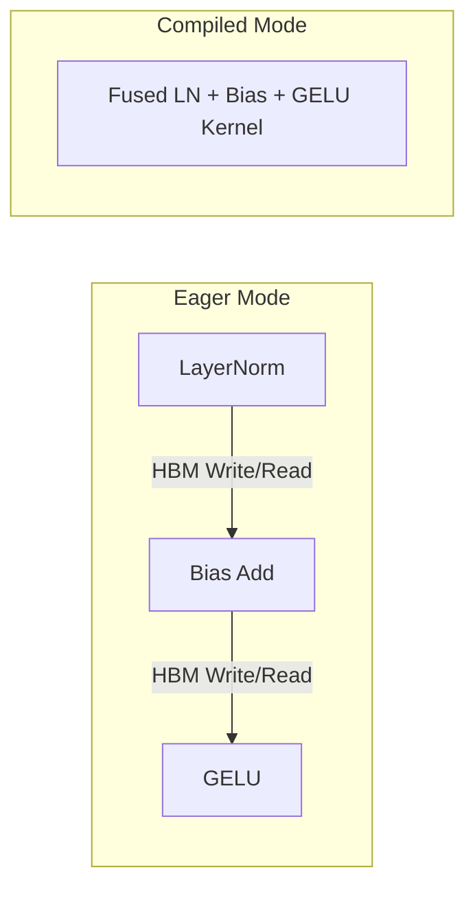

# 07. Optimization: Apple Silicon & Compilers

This document details the hardware acceleration, compiler optimization, and mixed-precision settings used in [benchmark.py](file:///Users/ahadk9/Projects/Andrej/benchmark.py) and [train.py](file:///Users/ahadk9/Projects/Andrej/train.py).

---

## 1. MPS (Metal Performance Shaders) Backend

Apple Silicon chips (M1/M2/M3/M4) do not use NVIDIA CUDA. Instead, PyTorch uses the **MPS** backend to compile and run operations on the Apple Silicon GPU cores.

In our code, we automatically target the best available device:
```python
if torch.backends.mps.is_available():
    device = "mps"
elif torch.cuda.is_available():
    device = "cuda"
else:
    device = "cpu"
```

### MPS Synchronization:
Because GPU execution is asynchronous, the CPU will submit commands to the GPU command queue and continue executing Python code immediately. If we want to measure execution time accurately, we must force the CPU to wait for the GPU to finish all queued operations:
```python
if device == "mps":
    torch.mps.synchronize()
```
Without calling `synchronize()`, timing operations (`time.time()`) will only measure the queue submission time (usually under $1\text{ ms}$), not the actual execution time.

---

## 2. Mixed Precision Training (AMP)

Standard training uses **float32** (32-bit single precision floating point) for weights, gradients, and activations. Each number takes 4 bytes of memory.

**Mixed Precision (AMP)** runs the forward pass in **float16** (16-bit half-precision, taking 2 bytes) and keeps a master copy of the weights in **float32** for parameter updates:

```python
if args.amp:
    with torch.amp.autocast(device_type=device, dtype=torch.float16):
        logits, loss = model(x, y)
```

### Why it accelerates training:
- **Memory Bandwidth**: Half the footprint means tensors can be read and written to GPU memory twice as fast.
- **ALU Throughput**: Apple Silicon Apple Neural Engine / GPU cores have dedicated float16 matrix multipliers (AMX/GPU matrix engines) that perform float16 operations twice as fast as float32.

---

## 3. Graph Compilation (`torch.compile`)

PyTorch normally runs in **Eager Mode**, executing operations one-by-one as they appear in Python:
```text
[Read X] -> [LayerNorm] -> [Write Temp1] -> [Read Temp1] -> [Linear] -> [Write Temp2] ...
```
This introduces significant overhead due to memory round-trips (writing and reading intermediate tensors from GPU memory).

`torch.compile` runs a compiler (TorchDynamo and Inductor) over the PyTorch code to trace the execution graph and perform **kernel fusion**:
- **Kernel Fusion**: Combines multiple adjacent operations (e.g. `LayerNorm` + `Bias Add` + `GELU`) into a single GPU/MPS operation.
- **Benefit**: Instead of writing intermediate results to memory and reading them back, compiled operations keep the data on-chip in fast cache memory.



---

## 4. Hardware Bottlenecks

When profiling training performance, throughput is typically limited by one of three bottlenecks:

1. **Compute Bound (ALU)**: The GPU cores are fully utilized performing matrix multiplications. This is the ideal state when running large batch sizes.
2. **Memory Bandwidth Bound**: The GPU arithmetic units are waiting for data to be read from or written to GPU memory. This is common in element-wise operations (such as activation functions, normalizations, and dropouts).
3. **Overhead Bound (CPU-GPU Launch Latency)**: The GPU completes computations faster than the CPU can queue up the next operations. This is common when running small models or micro-batch sizes.
   - *Note*: Our benchmarks show that on Mac Mini M4, eager FP16 runs at $\approx 14.5\text{ms}$ and compiled FP16 runs at $\approx 14.4\text{ms}$. The small speedup indicates that the compile backend for MPS is not yet performing deep kernel fusion on Metal, and eager execution is already highly optimized.
