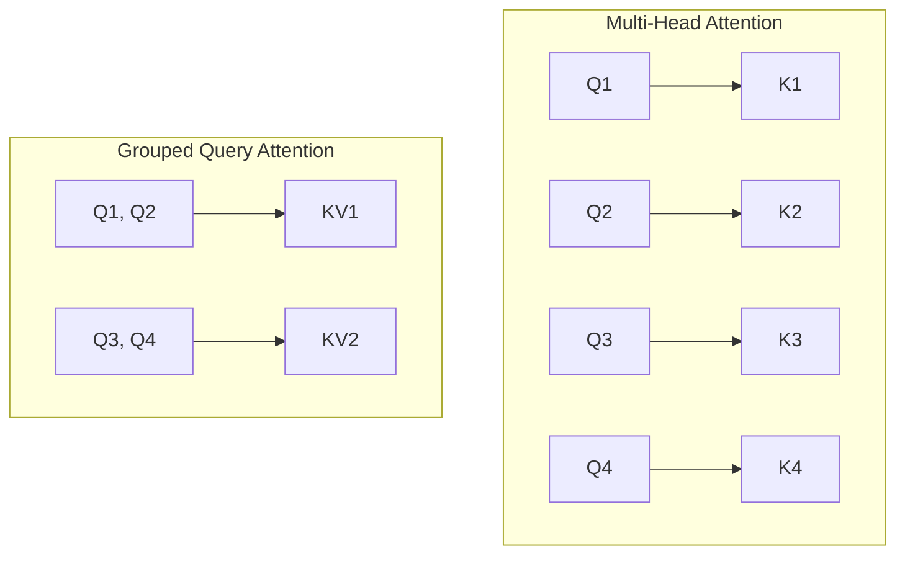

# 13. Connections to Modern LLMs

This document traces the evolution of core architecture components from GPT-2 (1999/2019 era) to modern Large Language Models (e.g. Llama-3, Gemma-2, DeepSeek-V3, Qwen-2.5, Mistral, Claude-3.5, and GPT-4-class systems).

---

## 1. Positional Representation: Absolute vs. Relative (RoPE)

- **GPT-2 Approach**: Uses a learnable **Absolute Positional Embedding** matrix `wpe` of shape $(T, C)$ [model.py:L186](file:///Users/ahadk9/Projects/Andrej/model.py#L186). The positional embedding vector is simply added to the token embedding.
- **Modern Approach**: Modern LLMs use **Rotary Position Embeddings (RoPE)**. RoPE applies a rotation to the Query and Key vectors in the complex plane, injecting relative position information directly into the dot product computation.
- **Is it still relevant?**: No. Absolute positional embeddings are rarely used in new models.
- **Why it changed**: Absolute embeddings do not generalize well beyond the context length used during training. RoPE represents relative distances, allowing models to scale their context length during inference (e.g., from 8k to 128k+ tokens) using techniques like RoPE scaling/interpolation.

---

## 2. Normalization: LayerNorm vs. RMSNorm

- **GPT-2 Approach**: Uses standard **LayerNorm** (`ln_1`, `ln_2`, `ln_f`) [model.py:L152](file:///Users/ahadk9/Projects/Andrej/model.py#L152). LayerNorm calculates both the mean and variance of the hidden states, subtracts the mean, divides by the standard deviation, and applies learnable scale ($\gamma$) and shift ($\beta$) parameters.
- **Modern Approach**: Modern LLMs use **RMSNorm (Root Mean Square Normalization)**. RMSNorm simplifies LayerNorm by assuming the mean of the activations is 0. It scales activations using only the root mean square value:
  $$\text{RMSNorm}(x) = \frac{x}{\sqrt{\frac{1}{d} \sum_{i=1}^d x_i^2 + \epsilon}} \odot \gamma$$
- **Is it still relevant?**: Yes, but RMSNorm has replaced LayerNorm in most modern architectures (Llama, Gemma, Mistral, DeepSeek).
- **Why it changed**: By avoiding mean subtraction, RMSNorm reduces computational overhead by 10-50% for normalization layers, improving training speed without sacrificing final model accuracy.

---

## 3. Attention: Standard Multi-Head vs. GQA/MQA

- **GPT-2 Approach**: Uses **Multi-Head Attention (MHA)** where every attention head has its own unique Query, Key, and Value projection vectors [model.py:L110-L116](file:///Users/ahadk9/Projects/Andrej/model.py#L110-L116).
- **Modern Approach**: Modern LLMs use **Grouped Query Attention (GQA)** or **Multi-Query Attention (MQA)**.
  - **MQA**: All Query heads share a single Key and Value head.
  - **GQA**: Query heads are divided into groups, and each group shares a single Key and Value head (e.g. 8 Query heads per 1 KV head).

- **Is it still relevant?**: GQA/MQA is now standard for models designed for fast inference.
- **Why it changed**: During inference generation, the Key-Value states of all past tokens are cached in memory (**KV Cache**) to avoid redundant calculations. Standard MHA requires storing a massive KV cache. Sharing Key/Value states reduces the KV cache memory footprint by 8x, allowing larger batch sizes and much faster generation throughput.

---

## 4. MLP Block: Standard FFN vs. SwiGLU

- **GPT-2 Approach**: Uses a standard FFN with a GELU activation: Linear ($C \to 4C$) $\to$ GELU $\to$ Linear ($4C \to C$) [model.py:L41-L68](file:///Users/ahadk9/Projects/Andrej/model.py#L41-L68).
- **Modern Approach**: Modern LLMs use **SwiGLU (Swish Gated Linear Unit)** feed-forward networks:
  $$\text{SwiGLU}(x) = \left( \text{Swish}(x W_{gate}) \otimes x W_{up} \right) W_{down}$$
- **Is it still relevant?**: FFN is still relevant, but SwiGLU has become the preferred choice for state-of-the-art models (Llama-3, Gemma-2, Qwen-2.5, DeepSeek).
- **Why it changed**: SwiGLU FFNs introduce a gating mechanism (multiplying two parallel linear projections) that allows the model to learn complex, coordinate-wise multiplicative interactions, yielding superior convergence rates compared to standard FFNs.

---

## 5. Model Architecture: Dense vs. Mixture of Experts (MoE)

- **GPT-2 Approach**: A **Dense** model. Every token passes through every single parameter in the model during every step.
- **Modern Approach**: Many leading modern LLMs (e.g. DeepSeek-V3, Mixtral, GPT-4) use a **Mixture of Experts (MoE)** architecture.
- **Is it still relevant?**: Dense models are still widely used for smaller scales, but MoE dominates large-scale efficiency.
- **Why it changed**: MoE replaces the MLP block with multiple parallel "expert" blocks. A router network selects the top $k$ experts (e.g. 2 out of 8, or 8 out of 256) to process each token. This allows scaling the total parameter count to hundreds of billions while keeping the active parameter count (and compute FLOP cost) per token relatively small.
